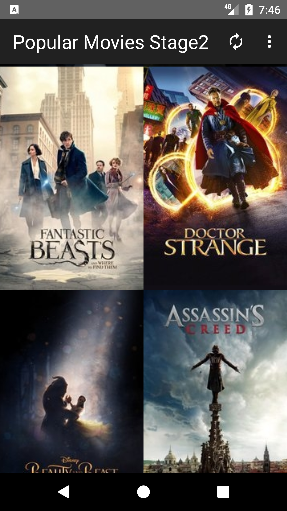
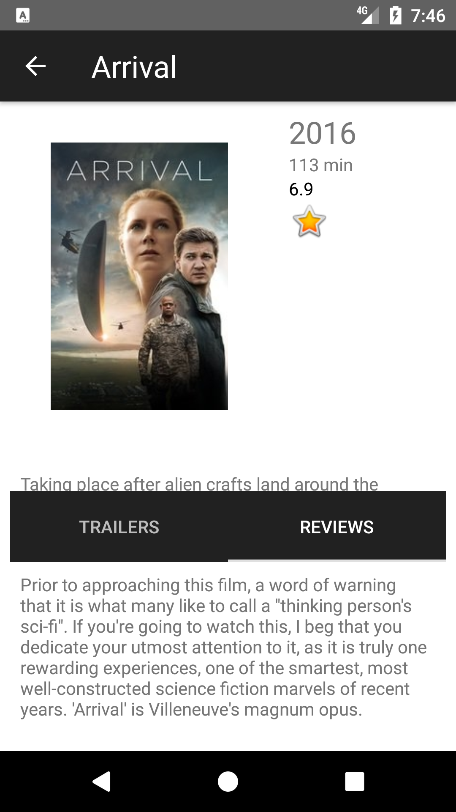
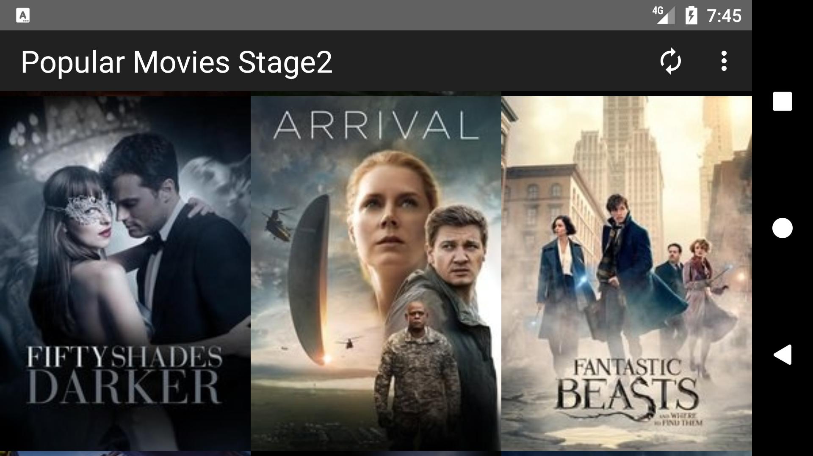
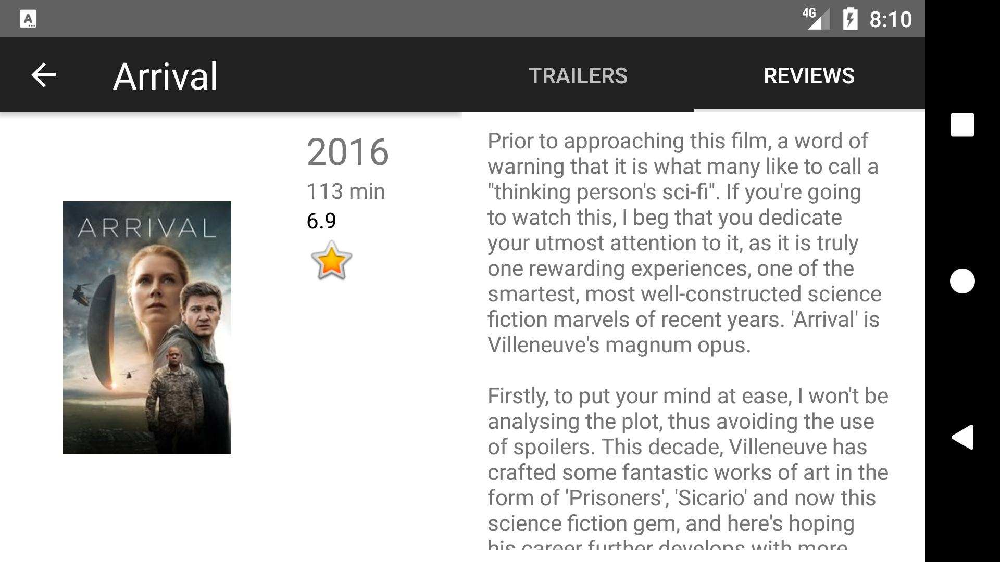
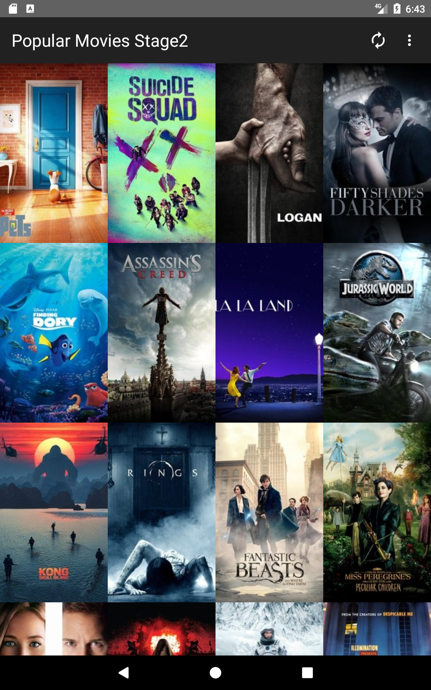
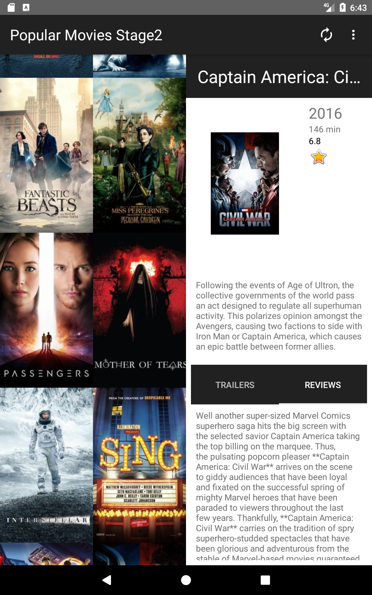
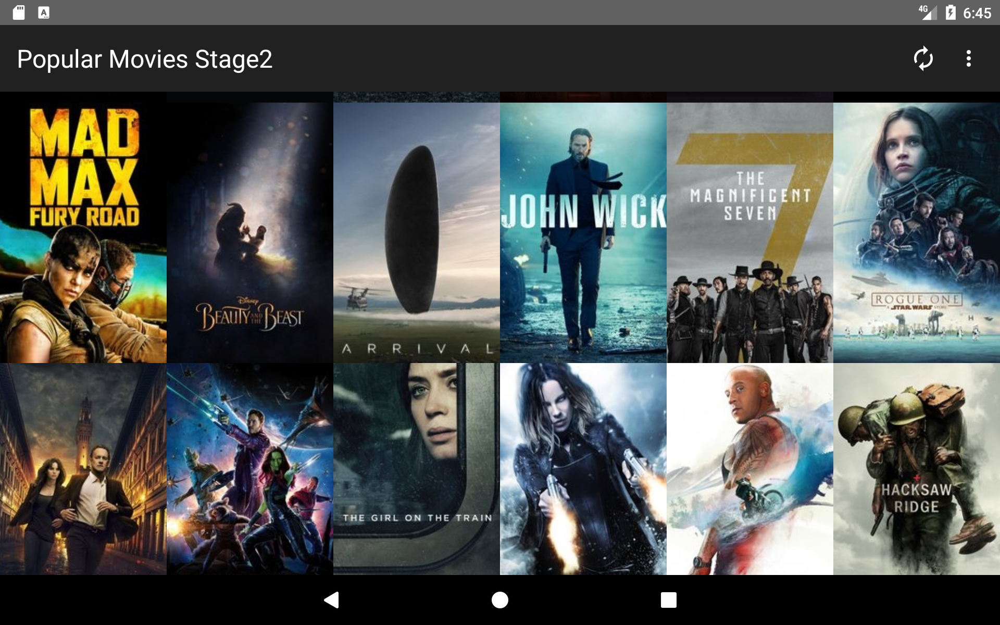
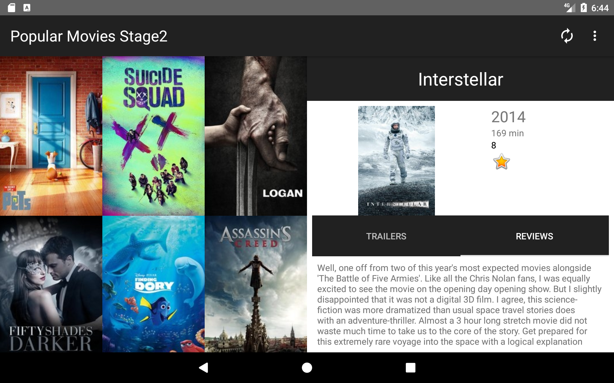

# popmovies_public

This app is a project for the Developing Android Apps course of Udacity's Android Developer Nanodegree program.
It retrieves movies from the [TMDB](https://www.themoviedb.org/?language=en) - a community-built movie database and displays them to the user.
The movie data is queried using TMDB's JSON API over HTTP protocol, then downloaded and stored in the local SQLite database.

Key Features:
1) Implementation of SyncAdapter to facilitate updates off UI thread
2) Implementation of ContentProvider for data management operations and interfacing with local SQLite database
3) Aggressive data pre-fetching
4) Custom image download and local storage mechanism (mostly for learning purposes)
5) Flexible Fragment-based UI design
6) UI optimization for multiple screens (phones/tablets)
7) Animated dynamic layout changes for tablet interface
8) Fragment visibility state retention across config changes for tablet layouts
9) Ability to add movies to your local favorites collection

## Try it yourself

In order to use this project, you'll need to register for and obtain a TMDB API Key.  It will not work without it.

You can do so at:  https://www.themoviedb.org/?language=en

Once you have obtained an API key, create a gradle.properties file under /app module, add the following line,
and place your key inside the quotes:
API_KEY="your_key_hex_value_goes_here"

## Phone UI Screenshots

##### Portrait main screen (left) and detail screen (right)

#### Landscape main screen (top) detail screen (bottom)

## Tablet UI Screenshots

##### Portrait main screen (left) and main screen with detail fragment (right)

#### Landscape main screen (top) main screen with detail fragment (bottom)

